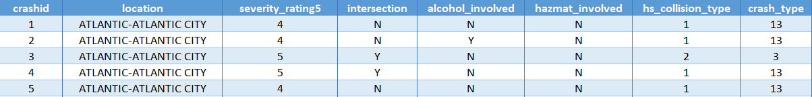
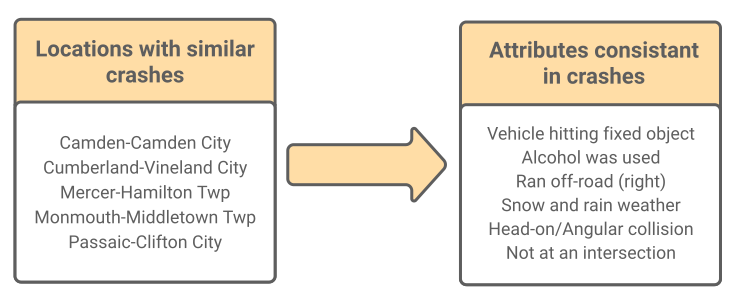
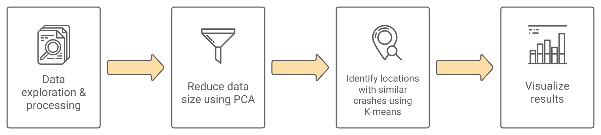
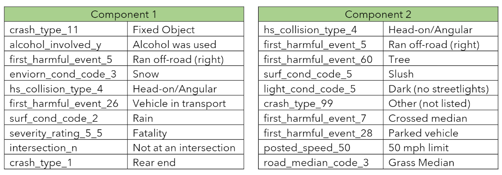
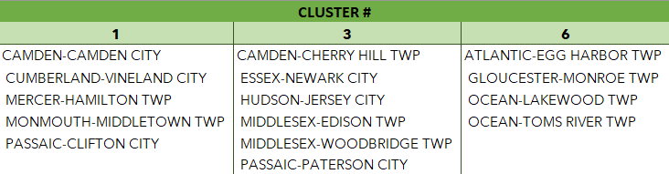
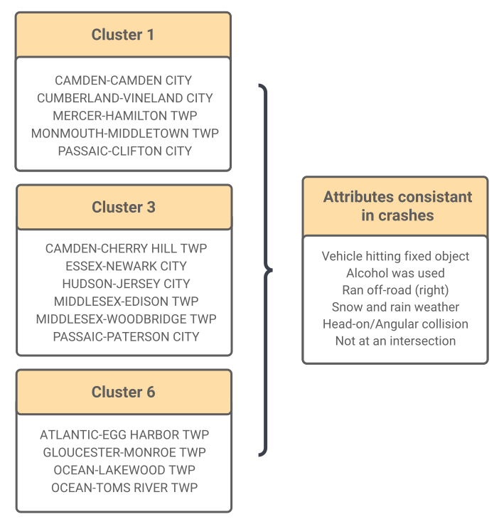

# Attribute Segmentation of New Jersey State Vehicle Crash Data

*Udacity Machine Learning Nanodegree - Capstone Project*

**Technologies Used**: Python, Jupyter, Amazon Sagemaker, Scikit-learn

## Table of Contents
  - [Project Overview](#project-overview)
  - [Technologies & Libraries Used](#technologies--libraries-used)
  - [Problem Statement](#problem-statement)
  - [Methodology](#methodology)
    - [Principal Component Analysis (PCA)](#principal-component-analysis-pca)
    - [K-means Clustering](#k-means-clustering)
  - [Results](#results)
- [Repository Structure](#repository-structure)
  - [Reports](#reports)
  - [Juypter Notebooks](#juypter-notebooks)
  - [Additional Materials](#additional-materials)
  
## Project Overview
This repository contains my Machine Learning (ML) capstone project files. This project aimed to identify crash patterns across New Jersey municipalities by using Principal Component Analysis and K-Means clustering algorithms to identify crash attribute trends. Crash attributes are characteristics of a crash, such as:
- alcohol use
- weather conditions
- street lighting type
- person's injury severity

This analysis identified New Jersey municipalities that had crashes with similar groups of attributes. Engineers can then identify problematic locations with these attribute groups, potentially implementing safety measures to prevent future crashes.

## Technologies & Libraries Used
This project utilizes Jupyter Notebooks with Python 3.8 to perform all data analysis and ML tasks. The two ML libraries used are:
1. **Amazon Sagemaker**: an open-source ML library for Python integration. Training models use Amazon's cloud servers and incur a fee for training time and uptime.
2. **SciKit-learn**: a free ML library easily imported into any Python environment. Training models are free and dependent on your hardware.

## Problem Statement
The New Jersey Department of Transportation publishes [crash data based on police reports](https://www.state.nj.us/transportation/refdata/accident/rawdata01-current.shtm). From 2014 through 2018, there were over 5 million crash data points, with each point having over 20 columns representing an attribute such as "alcohol used" or "weather conditions". The sheer volume of textual data makes it challenging to identify correlations between multiple crash attributes.

<figcaption><b>Figure 1: Sample of crash data</b></figcaption> 

The following are data analysis questions I wanted to explore:
- What attributes have the highest importance across all crash points?
- Are there crashes across NJ which have similar groups of attributes?
- Where are these groups located?
- How can this analysis help engineers prevent future crashes?

To answer these questions, I trained a K-means clustering model to group municipalities with crashes which have similar attributes.I also wanted to process the results from K-means into visuals that would be easy for engineers to understand (Figure 2).

<figcaption><b>Figure 2: Sample output from K-means model</b></figcaption> 

## Methodology
The methodology from data processing to K-means clustering is done in four steps (Figure 3).  

<figcaption><b>Figure 3: Methodology steps</b></figcaption> 

### Step 1: Data Exploration and Processing
Because many stakeholders involved in safety programs use crash data containing serious injuries or fatalities, crash data containing a serious injury or fatality were kept. The resulting dataset was reduced to 6,800 crashes. 

Next, data was pre-processed to prepare for K-means clustering. Because K-means clustering requires numerical data, all categorical data was encoded and normalized (Tables 1 & 2). This step resulted from 20 attributes to 174 attributes. For the K-means model to cluster locations with similar crash attributes, the attribute columns were summed and grouped by location (Table 3).

<figcaption><b>Table 1: Pre-processed data with categorical attributes</b></figcaption>

| Crash ID | Location               | Alcohol Involved | Weather Condition |
|----------|------------------------|------------------|-------------------|
| 1        | ATLANTIC-ATLANTIC CITY | Yes              | Rain              |
| 2        | BERGEN-HACKENSACK CITY | No               | Dry               |
 
<figcaption><b>Table 2: Post-processed data with encoded attributes using PCA</b></figcaption>

| Crash ID | Location               | Alcohol Involved Yes | Alcohol Involved No | Weather Condition Rain | Weather Condition Dry |
|----------|------------------------|----------------------|---------------------|------------------------|-----------------------|
| 1        | ATLANTIC-ATLANTIC CITY | 1                    | 0                   | 1                      | 0                     |
| 2        | BERGEN-HACKENSACK CITY | 0                    | 1                   | 0                      | 1                     |
 
<figcaption><b>Table 3: Sum of encoded columns grouped by location</b></figcaption>

| Location | Alcohol Involved Yes | Alcohol Involved No | Weather Condition Rain | Weather Condition Dry |
|----------|----------------------|---------------------|------------------------|-----------------------|
| ATLANTIC-ATLANTIC CITY         | 3                    | 46                   | 5                      | 27                     |
| BERGEN-HACKENSACK CITY        | 1                    | 31                  | 4                      | 20                     |

### Step 2: Principal Component Analysis (PCA)
PCA reduces the number of column attributes by removing redundant attributes and maintaining attributes with the highest weight. A 70% variance was chosen resulting in the top 25 attributes to be chosen. PCA also groups attribute patterns into "components" (Figure 4). Each component represents a group of attributes that have the highest correlation in a crash across all municipalities. After reducing the dataset, the data and components were used to train a K-means model for attribute segmentation.

<figcaption><b>Figure 4: Attributes making up Component #1</b></figcaption> 

### Step 3: K-means Clustering
To identify crash attribute patterns, a K-means model was trained using the resulting dataset from PCA. K-means algorithms are ideal for identifying similarities or differences within groups; in this case, the algorithm will group municipalities which have crashes with similar attributes. 

The results from the algorithm identifies the correlation between municipality groups (clusters) and PCA attribute components (Figure 5). The x-axis represents each location cluster and y-axis represents each attribute component. The heatmap values indicate correlation - a higher the value indicates a strong correlation is between location cluster and attribute component. 

Because K-means results can be difficult to explain using a standalone heatmap, I wanted to create visuals that would be easy for stakeholders or engineers to understand.

<figcaption><b>Figure 5: Correlations between Location clusters and PCA components</b></figcaption> 

## Step 4: Visualize Results
To visualize the final results, each component from PCA was translated and the K-means clusters were seperated into municipality groups. Attribute names in each component were translated into readable titles based on the titles in the New Jersey Police department crash form (Figure 6). Municipalities for each K-means cluster were identified (Figure 7). Using the PCA translations and K-means cluster makeup, groups of locations are correlated with similar crash patterns (Figure 8). 

<figcaption><b>Figure 6: PCA component translation samples</b></figcaption> 

<figcaption><b>Figure 7: K-means cluster makeup samples</b></figcaption> 

<figcaption><b>Figure 8: Municipality clusters with similar crash attributes</b></figcaption> 

# Repository Structure
The following section explains this repository's structure and contents.

    .
    ├── Additional Materials                 # Supporting material including all component makeup charts and heatmaps
    ├── Juypter Notebooks                    # Notebooks with Python code and documentation
    ├── Reports                              # PDF files of the Capstone Report and Proposal
    ├── repo-media                           # Images used in this readme
    └── README.md                              

## Additional Materials
Supporting material is found in the Additional Materials folder which includes all images of component makeup charts, attribute value heatmaps, cluster makeup Excel, raw data before pre-processing, and normalized dataset used to train the PCA and K-means model.

## Juypter Notebooks
A series of Juypter notebooks created for this project, each containing documentation and code. The following is a summary of all notebooks:
1. **Data Processing and Exploration**: data exploration, cleaning, and processing for PCA and K-means training
2. **SageMaker PCA KMeans**: PCA and K-means training using the Amazon Sagemaker Python API. Contains K-means cluster results indicating crash patterns grouped by NJ municipality
3. **Scikit-learn PCA KMeans**: PCA and K-means training using the Scikit-learn Python package. Contains K-means cluster results indicating crash patterns grouped by NJ municipality
4. **Scikit-learn PCA KMeans Refinement**: refining the K-means model from Scikit-learn to explore any differences in clustering results

## Reports
The following are technical documentation for the project:
1. **Capstone Report**: details the project goals, methodology, and results
2. **Proposal**: outlines the problem statement and proposed methodology for review
